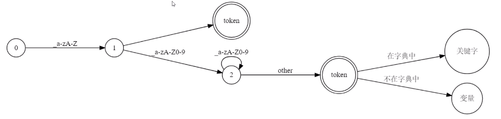

# 编译原理

- `字母表`: 语言L允许所有的字符 (如: ansii, utf8)
- `串(string)`: 是语言 L 字母表中字母的一个有穷序列
- 不可能所有串都是语言支持的，因此通常用一些约束来规则来描述串, 其中就有 `正则表达式`

## 词法分析器

目标:

- 给定程序语言 L 以及所有 L 支持的词汇，从中找出这些词汇，并为他们标注词性
- 如果源代码有语言 L 不支持的词汇，报错并提示用户

### 正则表达式

- 用于正则语言(一种形式的语言)的词法, 用一串字符串来描述正则语言 L 接受哪些词语，而不需要理解这些词语
- 最早由 Kleene 提出, 在 Unix 采用后被大众认可(grep, sed)
- 正则语言可以被确定，有限状态(状态有限)自动机理解
- 通常我们可以通过正则表达式描述一类`词法单元(符号)`
    - 关键词: (if|else|return|for|...)
    - 整数可以表示为[+-]?[0-9]+
    - 运算符号

简单问题: **区分关键词和变量名**

- 正则表示: `[_a-zA-Z][_a-zA-Z0-9]*`
- 状态机描述

**实现思考**

- 各个语言都提供正则表达式，从一个字符串(源代码) 中提取字符串容易，但是词法分析过程需要提取大量的字符串

### 用状态机提取词语

- 提取关键字变量名
- 提取字符串
- 提取操作符
- 提取数字

